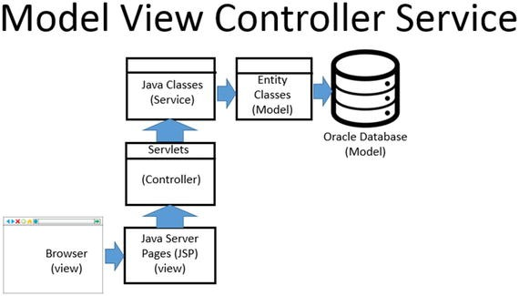

# Spring-Boot-Practice

## NOTE: This is a very basic example of Spring Boot - Google other Spring boot repos to better understand what each layer (model, services, controllers) should contain.

Model - This is what's connected to the database (Spring allows you to define tables and columns within the class). The application logic is defined here.

Controller - The controller defines entry points that clients from the outside world can talk with using REST operations. A controller controls the logic. 

Service - In an application, the business logic resides within the service layer ([defined here](https://www.geeksforgeeks.org/spring-service-annotation-with-example/)). This is where we want to create all the functions needed ([example](https://github.com/in28minutes/spring-boot-examples/blob/master/spring-boot-rest-services/src/main/java/com/in28minutes/springboot/service/StudentService.java))
